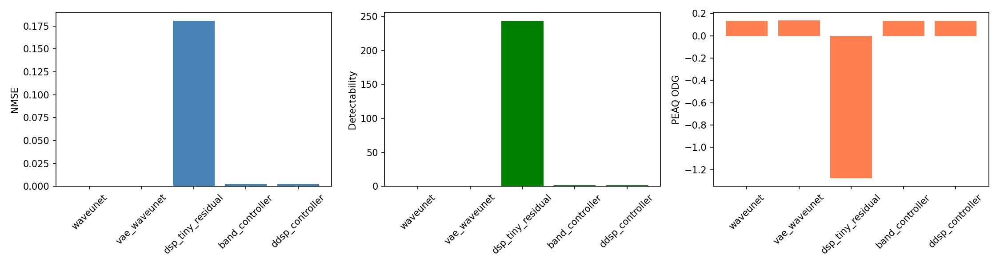
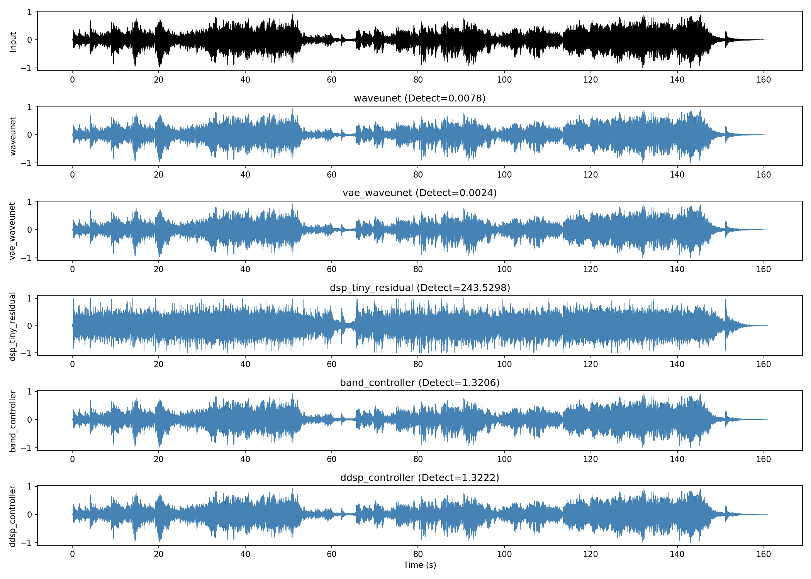
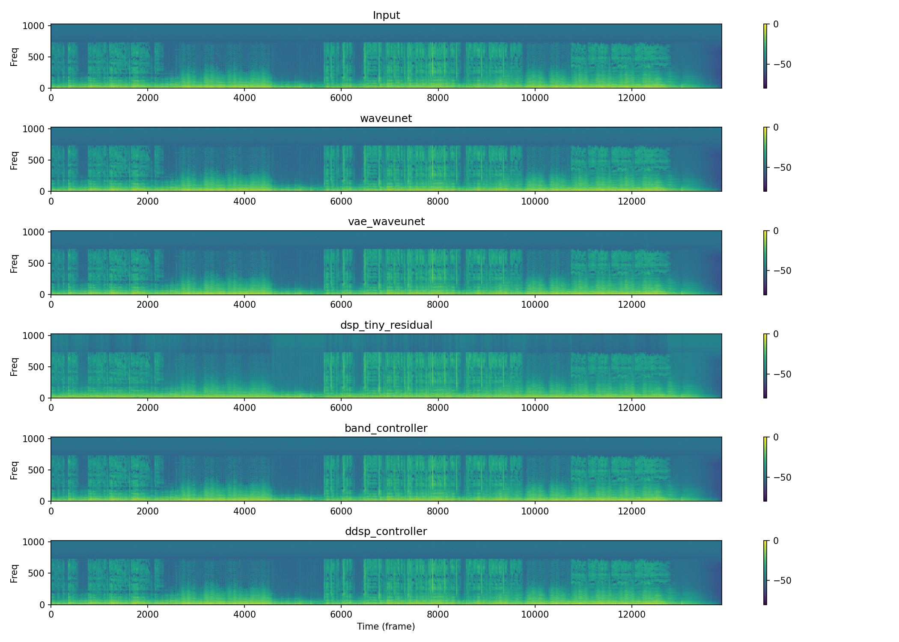
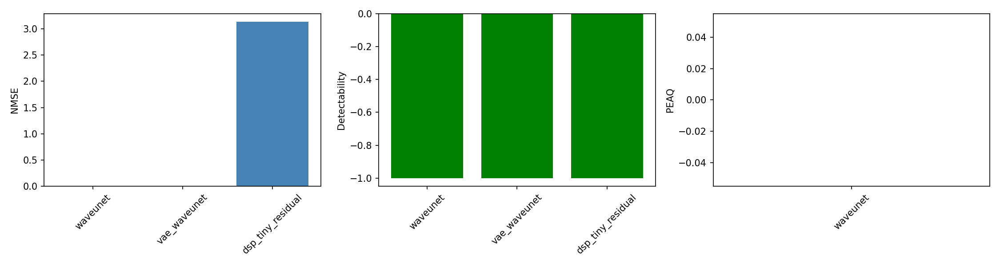
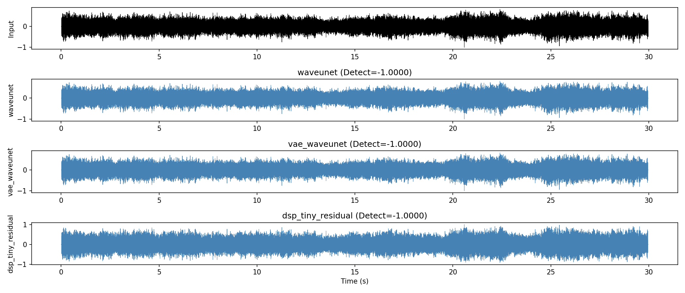
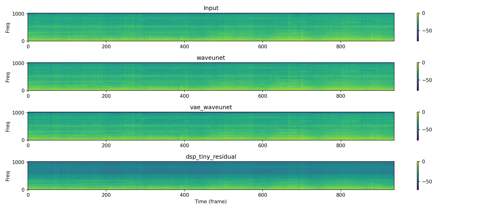

# WaveUNet-Bass

Waveform-domain perceptual loudness enhancement in PyTorch.

Five model families are trained in two stages on the FMA Small dataset:

| Model | Architecture | Stage 1 loss | Stage 2 fine-tuning |
|---|---|---|---|
| `waveunet` | Residual 1-D Wave-U-Net | L1 + NMSE + MRSTFT | Detectability |
| `vae_waveunet` | Variational Wave-U-Net (VAE bottleneck) | L1 + NMSE + MRSTFT + KL | Detectability |
| `dsp_tiny_residual` | Deterministic DSP + tiny residual network | L1 + NMSE | Detectability |
| `band_controller` | 4-band gain controller → FFT synthesis | L1 + NMSE | Detectability |
| `ddsp_controller` | Per-band gains + spectral tilt + envelope | L1 + NMSE | Detectability |

Stage 2 optimises detectability of the error signal `(output − input)` using a
perceptual masking curve from `libdetectability` / `controlmethods`.

## Current Status

- Dataset: FMA Small curated, peak-normalised, split by `track_id`
  - 1,480 unique tracks → 1,200 train / 120 val / 160 test
  - 23,680 frames total (1024 samples, 512 hop)
  - Zero cross-split leakage: verified by `scripts/check_contamination.py`
- Active dataset: `datasets/stage1_fma_curated_cli_norm.pkl`
- Stage 1 configs: `configs/stage1_*_fma_curated_cli_norm.yaml`
- Stage 1 best checkpoints: `checkpoints/stage1_*/best.pth`
- Stage 2 best checkpoints: `checkpoints/stage2_detectability_*/best_stage2.pth`

## Artifact Hygiene (Past vs Now)

## Artifact Hygiene

Active experiment roots (used for all new runs):

- `checkpoints/`
- `logs/`
- `outputs/`

Archived historical runs (pre-2026-04-08):

- `archives/past_until_2026-04-08/`

Policy: keep code/configs active in repo root; move old run artifacts into
`archives/<stamp>/...` instead of deleting.

---

## Quick Start

### 1) Install dependencies

```bash
pip install -r requirements.txt
# also install the perceptual model helper (from repo root)
pip install -e ../controlmethods-python
```

### 2) Prepare the curated FMA dataset

The dataset is already built and serialised. To rebuild it from FMA Small:

```bash
python scripts/setup_fma_baseline.py \
  --fma-root /path/to/fma_small \
  --output datasets/stage1_fma_curated_cli_norm.pkl
```

Verify zero cross-split leakage:

```bash
python scripts/check_contamination.py
```

### 3) Stage 1 — representation training

Train all five model families on the curated dataset:

```bash
# WaveUNet
python scripts/train.py --config configs/stage1_fma_curated_cli_norm.yaml --device cuda

# VAE WaveUNet
python scripts/train_vae.py --config configs/stage1_vae_fma_curated_cli_norm.yaml --device cuda

# DSP + residual
python scripts/train_dsp_residual.py --config configs/stage1_dsp_residual_fma_curated_cli_norm.yaml --device cuda

# Band controller
python scripts/train_band_controller.py --config configs/stage1_band_controller_fma_curated_cli_norm.yaml --device cuda

# DDSP controller
python scripts/train_ddsp_controller.py --config configs/stage1_ddsp_controller_fma_curated_cli_norm.yaml --device cuda
```

Stage 1 loss: **L1 + NMSE + MultiResolutionSTFT** (equal weights).

### 4) Stage 2 — detectability fine-tuning

Fine-tune all Stage 1 checkpoints using detectability of `(output − input)` as
the sole loss:

```bash
python scripts/stage2_detectability_all_models.py \
  --device cuda \
  --epochs 5 \
  --batch-size 16 \
  --lr 5e-5 \
  --detectability-weight 1.0 \
  --recon-weight 0.0 \
  --early-patience 3
```

This saves `checkpoints/stage2_detectability_<model>/best_stage2.pth` for each
model and writes a ranked leaderboard to:

- `logs/stage2_detectability_all_models_leaderboard.csv`
- `logs/stage2_detectability_all_models_summary.json`

**Stage 2 results (val set, lower detectability = better):**

| Rank | Model | Val detectability | Val NMSE |
|------|-------|-------------------|----------|
| 1 | `band_controller` | 0.022253 | 0.023025 |
| 2 | `ddsp_controller` | 0.022471 | 0.023006 |
| 3 | `waveunet` | 0.046387 | 0.000047 |
| 4 | `vae_waveunet` | 0.046985 | 0.000049 |
| 5 | `dsp_tiny_residual` | 21.816 | 0.123402 |

### 5) Stage 2 inference and evaluation

Run all Stage 2 models on any WAV file and produce listening outputs, NMSE,
detectability, PEAQ ODG and comparison plots:

```bash
python scripts/infer_stage2_all_models.py \
  --audio /path/to/your/audio.wav \
  --device cuda \
  --output-dir outputs/stage2_listening
```

Outputs written to `--output-dir`:

| File | Description |
|------|-------------|
| `input_normalized.wav` | Peak-normalised input |
| `<model>_output.wav` | Model output (peak-normalised) |
| `<model>_error.wav` | Residual `input − output` |
| `metrics_comparison.png` | NMSE / Detectability / PEAQ ODG bar chart |
| `waveform_comparison.png` | Time-domain overlay for all models |
| `spectrogram_comparison.png` | STFT spectrograms for all models |
| `results.json` | Full metric JSON |

**PEAQ ODG** uses the bundled `peaq-python-simple-main/AFsp-v9r0/bin/PQevalAudio`
binary (automatically resampled to 48 kHz). No extra installation needed.

**Sample results on external track "Je te laisserai des mots":**

| Model | NMSE | Detectability ↓ | PEAQ ODG ↑ |
|-------|------|-----------------|-------------|
| `vae_waveunet` | 0.000012 | 0.002420 | 0.138 |
| `waveunet` | 0.000050 | 0.007816 | 0.134 |
| `band_controller` | 0.002706 | 1.320550 | 0.134 |
| `ddsp_controller` | 0.002702 | 1.322188 | 0.134 |
| `dsp_tiny_residual` | 0.180680 | 243.530 | −1.279 |







**Reference track (FMA id 000890):**







---

## Zero Split and Leakage

Splitting is performed by `src/data/splits.py` → `split_by_track()`:

- Track IDs shuffled once with a fixed seed then partitioned 1200/120/160.
- All frames of one track stay in exactly one split — no frame-level overlap.
- Zero cross-split leakage confirmed by `scripts/check_contamination.py` on the
  current 23,680-frame dataset.

## Repository Paths

| Path | Purpose |
|------|---------|
| `configs/stage1_*_fma_curated_cli_norm.yaml` | Stage 1 training configs |
| `checkpoints/stage1_*/best.pth` | Stage 1 best checkpoints |
| `checkpoints/stage2_detectability_*/best_stage2.pth` | Stage 2 best checkpoints |
| `datasets/stage1_fma_curated_cli_norm.pkl` | Serialised training dataset |
| `logs/` | Training CSV/JSON logs |
| `outputs/` | Inference outputs and plots |
| `archives/` | Historical run artifacts (pre-2026-04-08) |
| `scripts/stage2_detectability_all_models.py` | Stage 2 trainer |
| `scripts/infer_stage2_all_models.py` | Stage 2 inference + metrics |
| `scripts/check_contamination.py` | Cross-split leakage check |
| `src/losses/perceptual.py` | `DetectabilityLossWrapper` |
| `src/models/` | All model architectures |
| `src/dsp/` | `FixedBandSplitter`, `FastDSPBaseline`, DDSP helpers |

## Documentation Map

See [docs/DOCUMENTATION.md](docs/DOCUMENTATION.md) for a full map of project
docs, canonical configs, and script descriptions.
